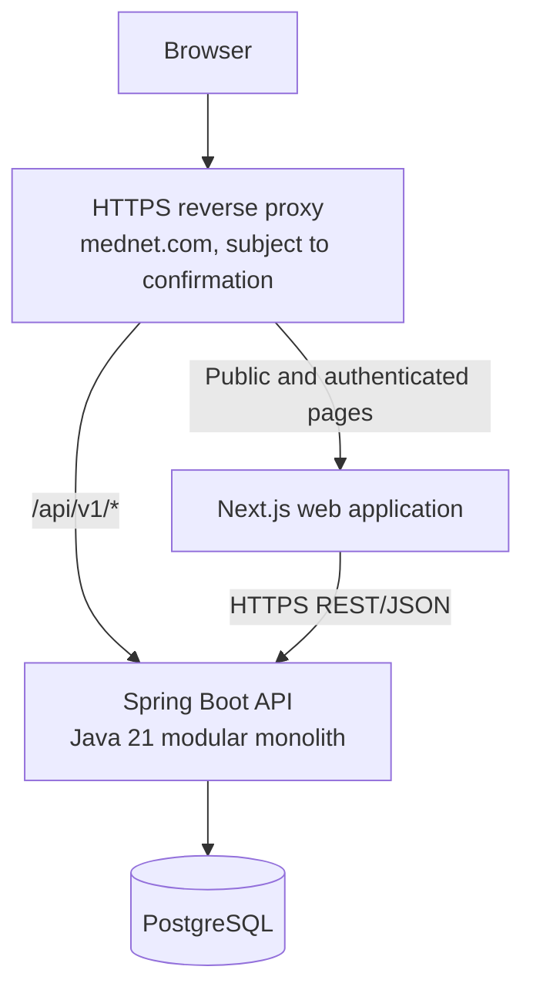

# MedNet Production Architecture Guide

## Status and purpose

This is a provisional engineering guide synthesized from the supplied architecture recommendation and the MedNet planning documents. It is guidance for design and implementation, not client-approved product scope. The product requirements in [req.md](req.md) remain authoritative for scope and open questions. Do not treat this guide as resolving a question marked OPEN in the PRD.

Use this guide together with the [backend and API plan](backend-api-plan.md), [frontend plan](frontend-plan.md), and [Spring Boot production structure](SPRING_BOOT_PRODUCTION_STRUCTURE.md).

## Recommended system shape

MedNet should present as one product and may use one public domain, while its web frontend, API, and database remain separate deployable components. A reverse proxy can route browser pages to Next.js and versioned API requests to Spring Boot.

### Component responsibilities

| Component | Responsibility |
| --- | --- |
| Next.js | Public, indexable information and provider-discovery pages; authenticated patient, provider, and administrator user experiences. |
| Spring Boot | The application authority for identity, authorization, relationships, business rules, validation, clinical workflows, transactions, audit events, and integrations. |
| PostgreSQL | Durable application data, including patient and provider data, appointments, records, messages, medication schedules, vitals, and service requests, subject to approved retention and privacy requirements. |
| HTTPS reverse proxy | Routes public web traffic and `/api/v1/*` traffic under the agreed domain; applies TLS and deployment-level routing policy. |

The frontend is never the security or business-rule authority. Hiding a button or protecting a route in Next.js is useful UX, but it is not authorization. Spring Boot must authenticate and authorize every protected operation before data is read or changed.

## Client and frontend direction

Next.js with TypeScript and the App Router is the current frontend recommendation because public pages need search indexing, metadata, sharing previews, and fast initial rendering, while authenticated areas need role-specific application flows. This remains provisional until OQ-50 is answered; it does not exclude a native mobile client or a different web framework if the sponsor chooses one.

Treat public and authenticated experiences differently:

- Public pages may include home, about, services, approved provider profiles, health resources, contact, and FAQ content. Keep public content indexable and provide page metadata.
- Private pages include sign-in, patient, provider, and administrator workflows. Require a validated session and avoid exposing clinical information in public responses, metadata, or caches.
- Keep feature code organized by capability, with shared UI and API utilities separated from patient, provider, administrator, and authentication features.
- Design for mobile use and intermittent, low-bandwidth connections: limit payloads, paginate results, avoid unnecessary requests, make retries safe, and show loading, empty, error, success, and recovery states.
- Use semantic HTML, keyboard navigation, screen-reader labels, readable contrast, visible focus, and touch-sized controls.

## Backend boundaries

Keep one Spring Boot deployable initially and organize it as a modular monolith. Feature modules should align with business capabilities such as `auth`, `patient`, `provider`, `appointment`, `message`, `record`, `medication`, `vital`, `homecare`, `laboratory`, `notification`, and `admin`.

Within the application, keep responsibilities explicit:

- API controllers handle HTTP, boundary validation, and response mapping; they stay thin.
- Application services coordinate use cases and transactions.
- Domain code owns business rules and state transitions without depending on HTTP.
- Infrastructure owns persistence, security adapters, audit storage, messaging, and external integrations.
- Shared code stays small and purpose-specific; avoid catch-all utility packages.

Do not introduce microservices, Kubernetes, Kafka, a service mesh, or multiple databases without a measured product or operational need. Preserve module boundaries so a later extraction is possible if evidence justifies it.

## Security and clinical-data access

Apply authorization at the Spring Boot boundary and in the relevant application policies. A role alone never grants access to every patient's data. For each protected resource, the server must identify the authenticated actor, check the role and requested action, verify the actor-patient relationship and its permitted scope, and record sensitive access where policy requires it.

Treat every client-supplied patient or provider identifier as untrusted. Do not rely on client-side route guards, submitted IDs, or hidden controls. Validate all inputs server-side, return no stack traces, and never log passwords, tokens, or clinical payloads. Keep credentials and service secrets outside source control.

The role list, account identity and verification process, consent, patient-record visibility, and administrator access remain governed by the corresponding open questions in [req.md](req.md), including OQ-02 and OQ-04–OQ-07. Do not implement guessed clinical permissions.

## API and data standards

- Put the authoritative REST/JSON API under `/api/v1` in Spring Boot. Next.js route handlers must not become a second authority for healthcare business rules.
- Publish and maintain an OpenAPI contract. Use resource-oriented names, boundary validation, pagination for collections, and stable error codes.
- Keep a consistent response envelope with `success`, `data` or `error`, and `meta.requestId`. Do not expose exception messages, SQL details, or stack traces to clients.
- Use PostgreSQL as the recommended relational store, subject to hosting, residency, backup, and recovery confirmation.
- Use Spring Data JPA/Hibernate and Flyway as the recommended persistence and schema-change approach. Treat migrations as versioned deployment artifacts; do not make ad hoc production schema changes.
- Scope transactions around operations that require atomic state changes, such as reserving an appointment slot and recording the resulting audit or outbox state. Do not annotate every method reflexively.

## Audit and operations

Make audit events a first-class capability for sensitive reads and writes, provider approval, appointment changes, record changes, medication changes, lab results, and administrator actions. Record actor, role, action, resource reference, timestamp, request ID, and outcome as appropriate; keep clinical content and secrets out of ordinary logs.

Add structured logs with request IDs, health/readiness checks, metrics for latency and failures, and tracing across the web, API, database, and external-service boundaries as operational needs mature. Configure explicit timeouts and failure policies for outbound integrations. Confirm production ownership for monitoring, backup, restore tests, and incident response.

Start deployment with a small number of separately deployable components behind HTTPS and a reverse proxy. Keep public pages, authenticated application routes, and `/api/v1/*` under the agreed domain where practical. Docker is a suitable packaging option; Kubernetes is not a day-one requirement. Domain ownership, hosting, data residency, and topology still need confirmation.

## Build, testing, and delivery

The supplied recommendation prefers Gradle with Kotlin DSL and a committed Gradle Wrapper for reproducible builds. The current MedNet starter has a Maven `pom.xml` and has been verified with `mvn test`; it does not yet include a Maven Wrapper. This documentation update does not migrate the codebase. Decide whether to keep Maven or migrate to Gradle before adding substantial backend modules, and maintain only one authoritative build system; do not add both wrappers as parallel build paths.

Use layered verification:

- Unit tests for domain rules and application policies.
- Spring integration tests for HTTP contracts, authentication, authorization, and persistence behavior.
- Testcontainers with PostgreSQL for database-backed integration tests.
- Frontend component and end-to-end tests for critical patient, provider, and administrator journeys.
- CI should lint, test, build, run security checks, publish an image, deploy, and verify health before promotion.

The first implementation slice is intentionally only the Spring Boot application and operational health probes. Add authentication, PostgreSQL, and feature modules only as their product decisions and security requirements are confirmed.

## Decision gates

Before committing to affected implementation details, resolve the applicable PRD questions, especially release scope (OQ-01/OQ-03), user roles (OQ-02), registration and verification (OQ-04–OQ-07), hosting and data handling, consultation mode (OQ-20), client platform (OQ-50), integrations (OQ-51), and applicable regulation (OQ-54). Record material engineering choices, including any build-tool migration, as explicit architecture decisions.